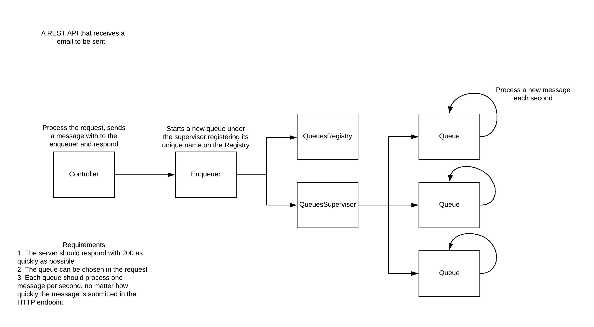

# EmailProcessor

A conceptual REST API that processes email messages.



## Requirements

1. The server should respond with 200 as quickly as possible
2. The queue can be chosen in the request
3. Each queue should process one message per second, no matter how quickly the message is submitted in the HTTP endpoint

## Running
```sh
$ mix deps.get
$ mix phx.server
```

## Usage
```sh
$ curl -X POST \
  http://localhost:4000/api/messages \
  -H 'Content-Type: application/json' \
  -d '{
	"queue_name": "important",
	"email": "john@mail.com",
	"subject": "Some subject",
	"message": "Message"
}'
```
